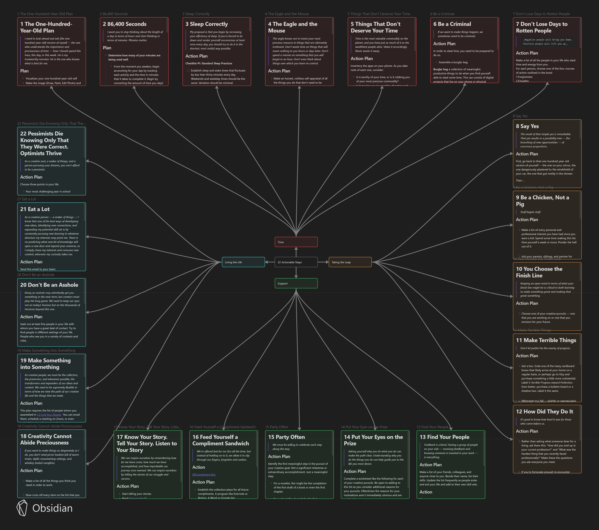

# SomedayisToday-ObsidianTemplate
22 actionable steps from [Someday is Today Book by Matthew Dicks](https://amzn.to/3GncXOr) <- Affiliate Amazon link

*This is not a replacement for reading the book. But a template to use once you have read the book or You can read a chapter and then try out the action plans.*

- Install [Obsidian](https://obsidian.md/)
- Use it as a template or Download the folder `22 action step of someday is today` 
- Use it in your own obsidian vault or make a new one.

 

All the credit goes to Matthew Dicks for writing this amazing book.

